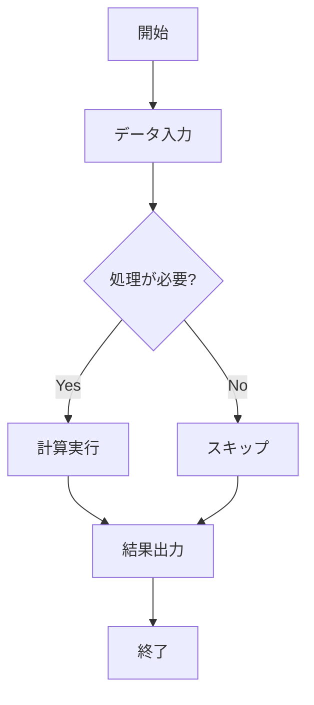
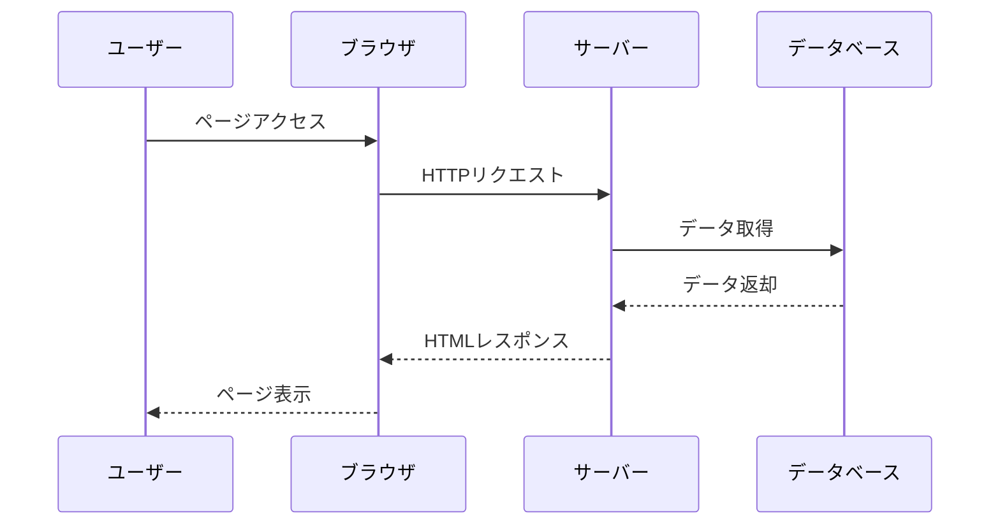
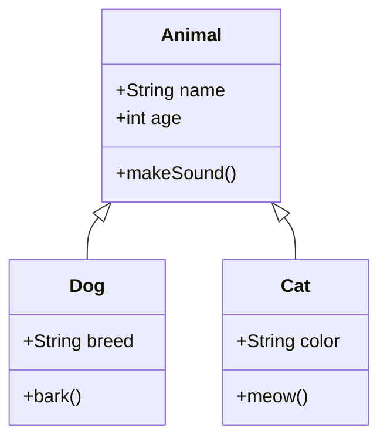
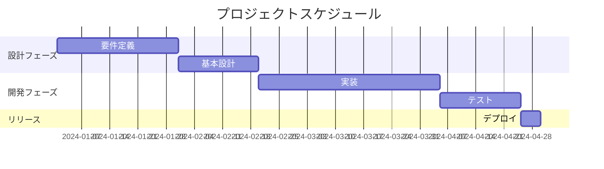
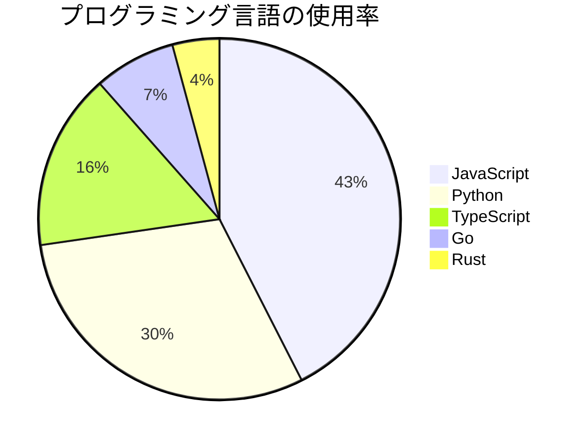
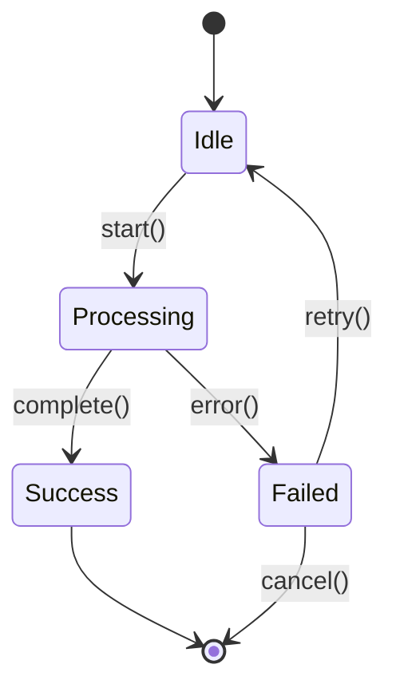
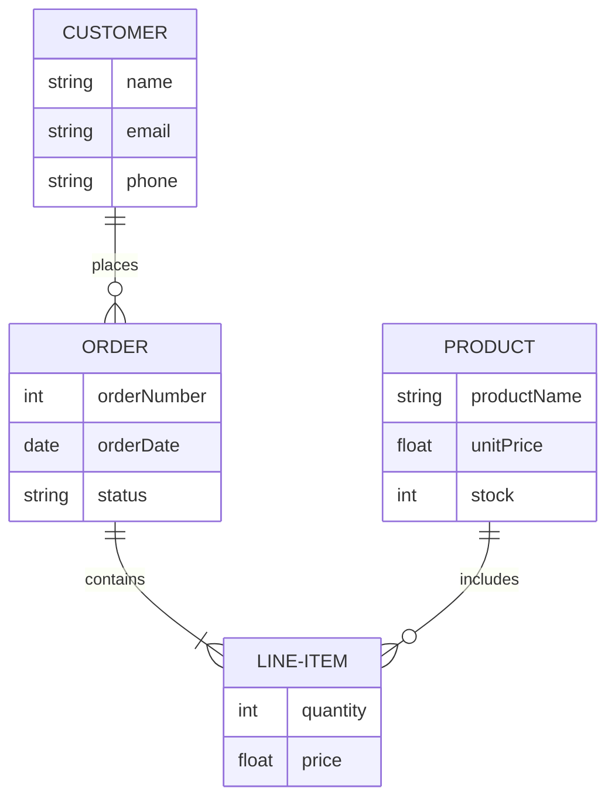
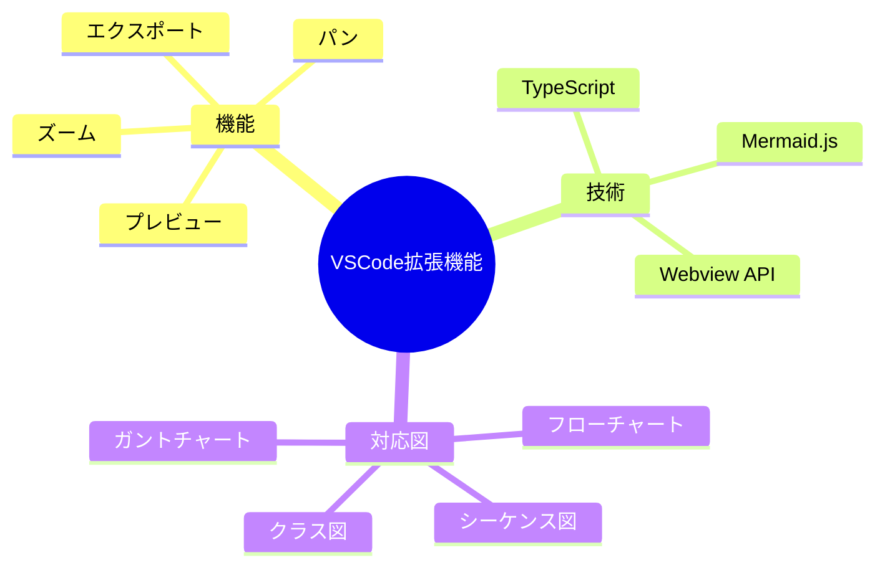

# Mermaid Preview テストファイル

このファイルは、Mermaid Preview拡張機能のテスト用サンプルです。

## フローチャートの例

## シーケンス図の例

## クラス図の例

## ガントチャートの例

## 円グラフの例

## 状態図の例

## ER図の例

## マインドマップの例

## 使い方

1. 上記のいずれかのMermaidコードブロック内にカーソルを配置
2. `Ctrl+Shift+M` (Windows) または `Cmd+Shift+M` (Mac) を押す
3. プレビューパネルが表示されます

または、コードブロック全体を選択してからショートカットキーを押すこともできます。
